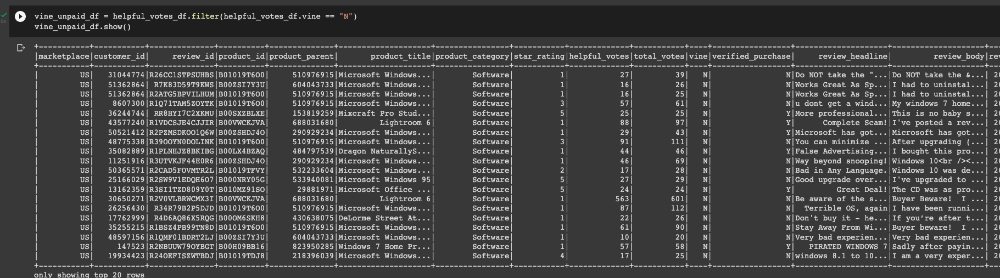

# Amazon_Vine_Analysis

## Overview of the analysis:
In this project, we are using Pyspark, SQL platforms to analyze Amazon reviews dataset from written by members of the paid Amazon vine program. Becaues
those platforms can determine if there have any bias in Amazon reviews from the vine program with our dataset.
Using Pyspark work with Google Gollaborate notebook to perform the ETL process to extract the Amazon reviews data. Then we use AWS (Amazon Web Services)RDS instance, store them tranformed data into our pgAdmin's server. I'm focus on software review in U.S.

## Results:
- Customer Table

- Product Table

- Review ID Table

- Vine Table

- Vine paid vs Vine unpaid

- 5-star review
Vine reviews have 248, non_Vine reviews have 17514. Vine reviews were 5 stars have 102, non-Vine reviews were 5 stars have 5154. 
The percentage of vine revies were 5 stars was 41.12%, non-Vine reviews percentage was 29.43%

##Summary: Base on the result the vine review member have lower number at 248 versus non-vine reviews member at 17514.However, vine reviews member have higher percentage at 41.12% rather non-vine reviews member at 29.43%. That's mean the vine progarm perform a positive bias.
On the another way, we could analyze vine and non-vine from a subset of the original data. If we split these two datasets might seek any bias in broader data.
